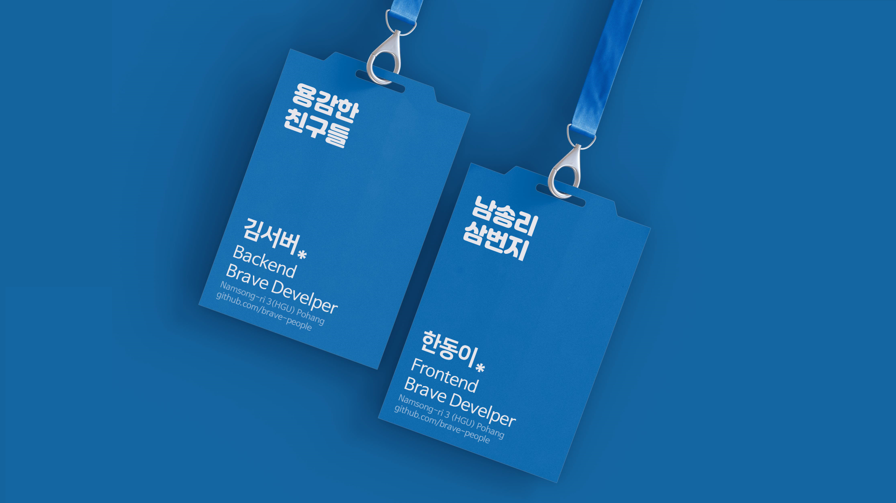

<div align=center>

# 🦸‍♂🦸‍♀용감한 친구들을 소개합니다

</div>

용감한 친구들을 소개합니다! 용감한 친구들 맴버들은 다음과 같은 방법으로 용감한 친구들 프로필을 등록할 수 있습니다. 

아래 설명을 차근차근 따라오시다보면 PR(Pull Request)도 어렵지 않아요!<br />여러분이 작성한 PR이 `merge` 되면, 용감한 친구들 Github pages에 인사말이 등록됩니다.

------

## 프로필 양식 양식

- 프로필 url이 없을 경우 https://avatar.tobi.sh/tobiaslins.svg?text=BP 좌측 text parameter에 본인의 이니셜로 변경해주세요.
  - 예시)`https://avatar.tobi.sh/tobiaslins.svg?text=BP`
- emoji 필드는 여기에서 찾아 복사 붙여넣기 해주세요 (키보드의 기본 이모지를 사용하셔도 됩니다.) 👉 [emojipedia.org](https://emojipedia.org/)
- SNS 계정은 아이디(@이하 메일 제외)만 적어주시면 됩니다. 예시) brave-people

```
---
name: {{이름}}
image: {{프로필 사진 url}}
emoji: 🦸‍♂
message: {{인사말}}
facebook: {{계정 아이디 / 없으면 해당 라인 삭제하셔도 됩니다.}}
twitter: {{계정 아이디 / 없으면 해당 라인 삭제하셔도 됩니다.}}
github: {{계정 아이디 / 없으면 해당 라인 삭제하셔도 됩니다.}}
---
```

------

## 1. Fork 하기

우선 PR을 하기 위해 현재 repository(이하 저장소)를 자신의 계정으로 포크 해주세요. Fork는 현재 저장소를 자신의 저장소로 전체 복사하는 것을 의미합니다. Fork한 저장소는 본인 계정의 저장소가 되어 직접 소스를 관리할 수 있습니다. 이를 통해 원래 저장소에 직접 액세스 할 필요 없이 프로젝트에 기능을 추가 할 수 있습니다.

그럼, 이 저장소를 Fork하는 것으로 시작해볼까요?


저장소 상단의 fork 버튼을 클릭합니다.

------

## 2. 프로필 추가하기

저장소는 이제 GitHub 프로필 아래에 별도의 저장소로 존재합니다.

포크에서 `/ _guestbook` 폴더로 가서 **Create new file**을 클릭해 새 파일을 만들어주세요.
이 파일 이름을 **{yourname}.yaml**로 해주세요. 그런 다음 아래 양식을 파일에 붙여 넣고 자신의 정보로 바꿉니다. *name* 및 *image*를 제외하고 필요하지 않은 필드는 삭제할 수 있습니다.

```
---
name: 김용감
image: https://avatar.tobi.sh/tobiaslins.svg?text=YG
emoji: 🦸‍♂
message: 서버 개발에 관심있는 김용감합니다. 현재 "용감한 사람들 코리아"에서 근무하고 있습니다.
facebook: brave-people
twitter: 
github: brave-people
---
```


> 자신의 사진을 사용하지 않으려면 https://avatar.tobi.sh/tobiaslins.svg 에 parameter로 이니셜을 추가해주세요. `?text=YG` 프로필 사진대신 이니셜이 나옵니다.

> 이모지 필드는 여기에서 찾아 복사 붙여넣기 해주세요! (키보드의 기본 이모지를 사용하셔도 됩니다.) 👉 [emojipedia.org](https://emojipedia.org/) 


------

### 3. Commit하기

새 파일 만들기 페이지에서 이제 수정된 내용을 `commit`할 수 있습니다. 페이지 하단에서 커밋 세부 내용을 채워주시고, **Commit new file** 버튼을 클릭해주세요.

<br />

Summary(작은 박스)에는 `[Add] young-gam.yml file` Description(큰 박스) `김용감 프로필 추가` 라고 작성하시면 됩니다.


------

### 4. PR(Pull request) 제출하기

원하는 내용을 변경 했으므로 **upstream** (원래 저장소)에 PR을 제출할 수 있습니다. [GitHub Flow](https://guides.github.com/introduction/flow/)
upstream에 PR을 제출하면 내 코드를 반영할 수 있습니다. (upstream이란, 내가 fork했던 원래 저장소를 의미합니다.)

내 저장소 페이지에서 저장소 이름 아래를 보면 **forked from :** 으로 표시됩니다.<br />PR을 제출하려면 **Pull request** 탭을 누르고, **New pull request** 버튼을 누르세요.

GitHub가 자동으로 감지하지 못하는 경우 *compare across forks*를 클릭해주세요. 그 다음 PR을 생성하세요.

base repository는 brave-member의 저장소가 될 것이고, head repository는 자신이 수정한 저장소의 브랜치가 될 것입니다.
PR은 `master` 쪽으로 제출해주시면 됩니다.


------

### 5. 축하합니다!! :tada:

여러분은 성공적으로 PR을 제출하셨습니다!! 
담당자가 PR을 승인하면 [brave-people.github.io/brave-member](https://brave-people.github.io/brave-member/)에 반영됩니다.

--------

- Cover image from [freepik.com](https://www.freepik.com/free-psd/set-two-badge-identity-cards-mockup_8950656.htm#page=1&query=employee%20card&position=14). - Free img
 - Readme Inspired by [DevFest-Seoul-2019-guestbook](https://github.com/GDG-Seoul/DevFest-Seoul-2019-guestbook)
